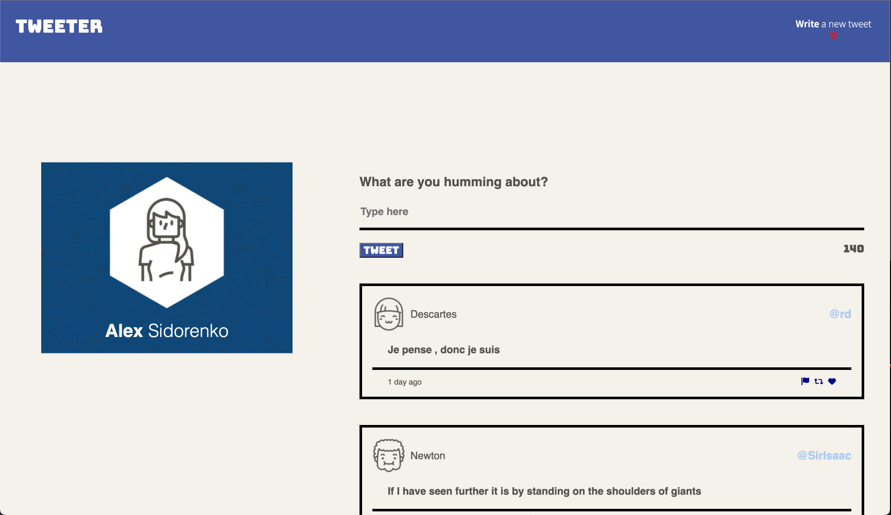
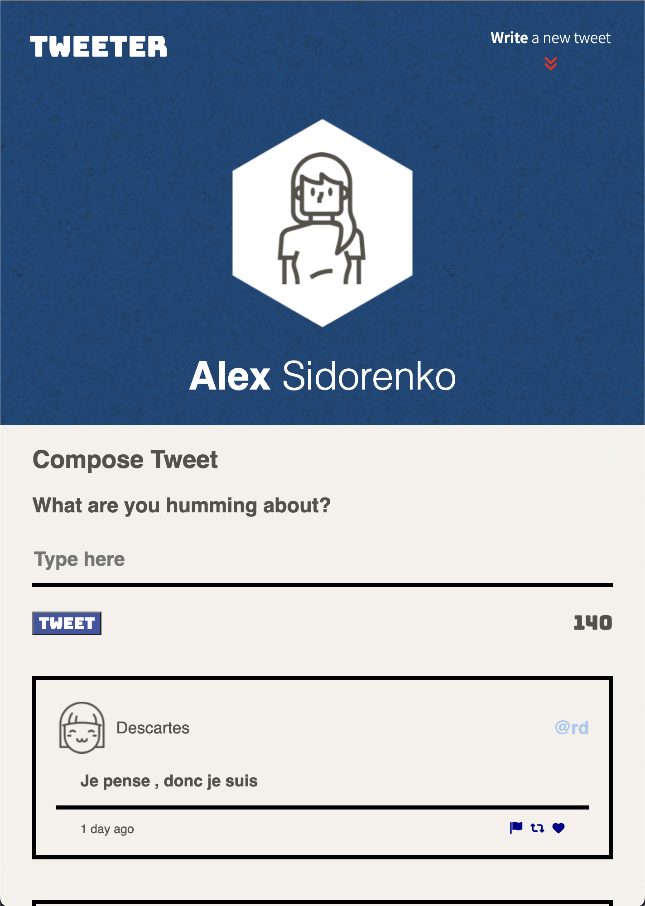
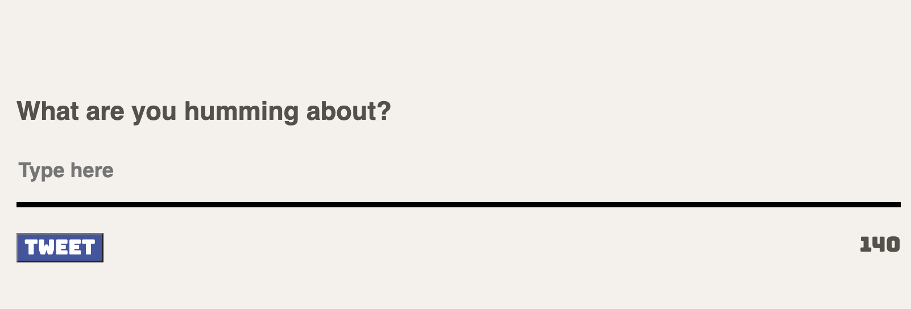
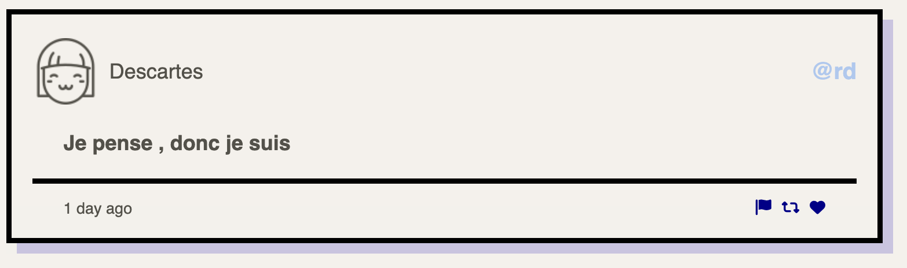
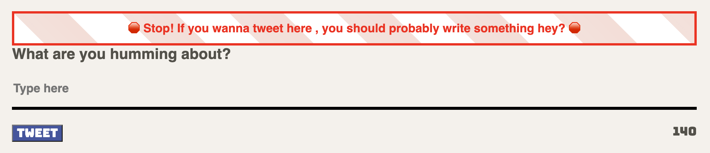
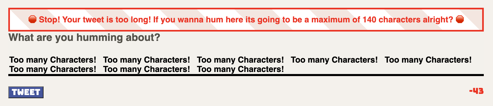

# Tweeter Project

Tweeter is a Single Page App (SPA) built with HTML, CSS, JS, jQuery and AJAX to help create a Twitter clone with a responsive design , animations , and more!

## Final Product

## Dependencies

- Node
- Express
- Chance
- md5
- body-parser

## Development Dependencies

- Nodemon

## Extras

- Responsive design using Media queries and Rem units
  `(Try it out, with zooming in and out) CMD ( + , - )`
- SASS

## Getting Started

- Install all dependencies (using the `npm install` command).
- Run the development web server with nodemon using the `npm run local` command.

## Using Tweeter

1.Tweeters homepage. Depending on your device , the homepage will have a different style.

Large Screen Homepage (for screen widths of 1024px or more):

Small Screen Homepage (for screen widths less than 1024px):

    

2. Both homepages will have a place where you can write a tweet. The remaining characters avaliable
   for your tweet are displayed in the bottom right corner. This will turn red if you exceed the max.

   

3. Once you write a VALID tweet. It will appear below automatically. Your tweet will have information about the users avatar photo, their name , and handle. Below that your tweet text , and the amount of time that had gone by since that tweet was created, and icons that will change color once you mouse over them.

   

4. A INVALID tweet will refer to tweets that exceed the 140 character cap , and
   tweets that have an empty input.If you still forget, its okay! A nice error pop-up will remind you of your mistake.

   Character Length Error:
   

   Empty Fields Error:
   

5. Thank you ! Happy Tweeting!
