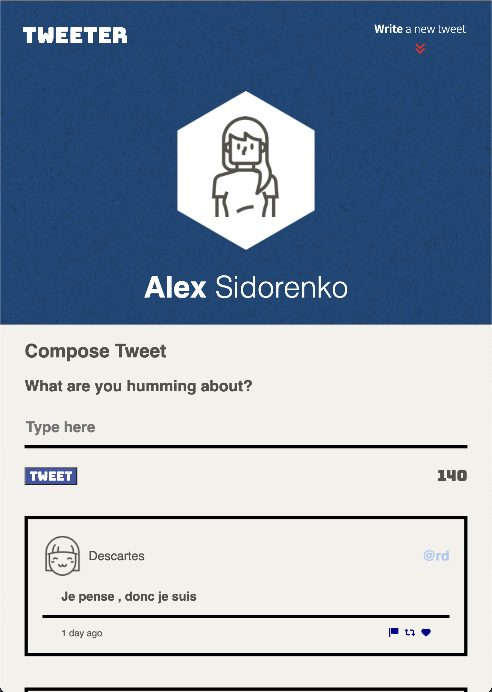

# TinyApp Project

Tweeter is a Single Page App (SPA) built with HTML, CSS, JS, jQuery and AJAX to help create a Twitter clone with a very responsive design

## Final Product

## Dependencies

- Node
- Express
- Chance
- md5
- body-parser

## Development Dependencies

- Nodemon

## Extras

- Responsive design using Media queries and Rem units
  `(Try it out, with zooming in and out) CMD ( + , - )`
- SASS
- Animations (Buttons, icons , etc)
- Audio (Turn up the audio when clicking the tweet button)

## Getting Started

- Install all dependencies (using the `npm install` command).
- Run the development web server with nodemon using the `npm run local` command.

## Using Tweeter

1. Once you visit localhost:8080, you will be greeted with Tweeters homepage. Depending on your device , the homepage will have a different style.

   Large Screen Homepage (for screen widths of 1024px or more):

   

   Small Screen Homepage (for screen widths less than 1024px):

    

2. Both homepages will have a place where you can write a tweet. The remaining characters avaliable
   for your tweet are displayed in the bottom right corner. This will turn red if you exceed the max.

   

3. Once you write a VALID tweet. It will appear below automatically. Your tweet will have information about the users avatar photo, their name , and handle. Below that your tweet text , and the amount of time that had gone by since that tweet was created, and icons that will change color once you mouse over them.

   

4. A INVALID tweet will refer to tweets that exceed the 140 character cap , and
   tweets that have an empty input.If you still forget, its okay! A nice error pop-up will remind you of your mistake.

   Character Length Error:
   

   Empty Fields Error:
   

5. Lastly, you can also try the extra features! You have probably noticed a red arrow jumping up and down in the header. Well ,this is actually a button that will enable you to hide the create tweet field so you arnt distracted from reading all your friends posts. If you do decide to write again , you can click the same button and it will reappear with focus on the input so you can be ready to tweet away!

   

   Also once you your tweets get big enough, to the point that you need to scroll to see older tweets, you will see a red bubble jumping up and down that says "Go Up". Clicking on this will help you scroll to the very top of the page, just incase you remembered something important you wanted to tweet about!
   

6. Thank you ! Happy Tweeting!
